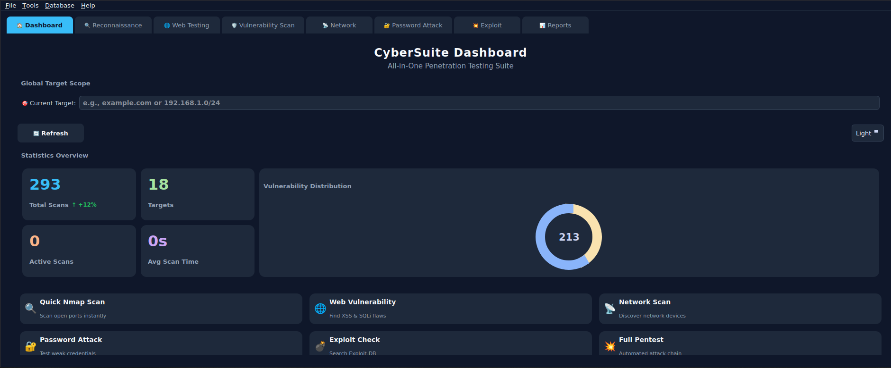

# 🛡️ CyberSuite

<p align="center">
  
</p>

<p align="center">
  <strong>An All-in-One GUI Penetration Testing Suite built with Python & PySide6</strong>
</p>

<p align="center">
  
  
  
  
</p>

---

# 📖 About the Project

**CyberSuite** is an **All-in-One GUI Penetration Testing Suite** developed in **Python** using **PySide6**. It provides a modern graphical interface for managing and executing multiple penetration testing and reconnaissance tools from a single dashboard.

Instead of switching between multiple terminal windows, CyberSuite centralizes common security assessment tasks into an intuitive GUI, making penetration testing faster, more organized, and easier to manage.

## ✨ Features

- 🔍 Network Reconnaissance
- 🌐 Website Technology Detection
- 🛡️ Vulnerability Scanning
- 📂 Directory Enumeration
- 💉 SQL Injection Testing
- 📊 Vulnerability Management
- 📄 HTML / JSON / CSV Report Generation
- 🎨 Modern Dark-Themed Interface

---

# 🖥️ Dashboard Preview

<p align="center">
  
</p>

<p align="center">
  <i>CyberSuite Main Dashboard</i>
</p>

---

# 🛠️ Integrated Tools

| Category | Tools |
|----------|-------|
| Network Scanning | Nmap |
| Subdomain Enumeration | Amass |
| Website Fingerprinting | WhatWeb |
| Directory Enumeration | Dirsearch |
| Vulnerability Scanning | Nikto |
| SQL Injection Testing | SQLMap |

---

# ⚙️ Installation

## Prerequisites

- Python **3.8+**
- Git
- Required security tools installed and added to your system PATH
  - Nmap
  - SQLMap
  - Nikto
  - Amass
  - WhatWeb
  - Dirsearch

---

## Clone the Repository

```bash
git clone https://github.com/yourusername/CyberSuite.git

cd CyberSuite
```

---

## Create Virtual Environment

### Linux / macOS

```bash
python3 -m venv venv
source venv/bin/activate
```

### Windows

```bash
python -m venv venv

venv\Scripts\activate
```

---

## Install Dependencies

```bash
pip install -r requirements.txt
```

---

# 🚀 Running CyberSuite

### Linux / macOS

```bash
python3 main.py
```

### Windows

```bash
python main.py
```

Alternatively,

```bash
run.bat
```

or

```bash
./run.sh
```

---

# 📂 Project Structure

```text
CyberSuite/
│
├── assets/
│   ├── dashboard.png
│   └── logo.png
│
├── modules/
├── reports/
├── requirements.txt
├── main.py
├── run.bat
├── run.sh
└── README.md
```

---

# 📑 Report Formats

CyberSuite can export scan results in:

- HTML
- JSON
- CSV

---

# ⚠️ Disclaimer

CyberSuite is intended **only for educational purposes and authorized security testing**.

Always obtain explicit written permission before scanning or testing any system or network. The developer is **not responsible** for any misuse of this software.

---

# 👨‍💻 Author

**Ishan Ali**

Cyber Security Enthusiast • Ethical Hacker • Python Developer

GitHub: https://github.com/IshanSEC

---

## ⭐ Support

If you found this project helpful, consider giving it a ⭐ on GitHub!
